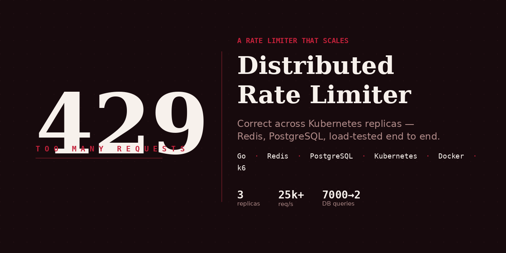

# Distributed Rate Limiter / API Gateway (Go + Redis + Postgres + Kubernetes)

<p align="center">
  
</p>

<p align="center">
  
  
  
  
  
</p>

A per-user, per-endpoint token bucket rate limiter, built incrementally from a
single-process in-memory design into a distributed, Redis-backed service
deployed across multiple Kubernetes replicas — with every major design
decision, bug, and its fix documented as it actually happened, not cleaned up
after the fact.

**Two branches, two real stages of this project:**
- `main` — current distributed design (Redis + Postgres + Kubernetes)
- `legacy-in-memory-lru-ttl` — the original single-process design (sharded
  in-memory storage, a hand-built LRU doubly-linked list, a TTL sweep
  goroutine). Kept intentionally, not deleted, because the reason it was
  replaced (state not shared across instances) is itself part of the story —
  see "Why the design changed" below.

## Table of Contents

- [Problem Statement](#problem-statement)
- [Why the Design Changed](#why-the-design-changed)
- [Architecture](#architecture)
- [Design Decisions](#design-decisions)
- [Known Bugs Found and Fixed During Development](#known-bugs-found-and-fixed-during-development)
- [Known Limitations and Future Work](#known-limitations-and-future-work)
- [Testing](#testing)
- [Running Locally (no Kubernetes)](#running-locally-no-kubernetes)
- [Running on Kubernetes (Local)](#running-on-kubernetes-local)
- [Cross-Replica Correctness Proof](#cross-replica-correctness-proof)
- [Load Test Results](#load-test-results)
- [Tech Stack](#tech-stack)

## Problem Statement

APIs need to limit how often a given user can hit a given endpoint, without
the limiter itself becoming a bottleneck, a single point of failure, or an
unbounded memory sink — and it needs to work correctly when the API is
running as multiple independent replicas behind a load balancer, not just on
one process.

This project implements a **token bucket** rate limiter that:
- Tracks limits independently per `(userID, endpoint)` pair
- Allows configurable burst capacity and refill rate per endpoint, loaded
  from Postgres
- Rejects requests instantly (non-blocking) rather than making callers wait
- Enforces limits correctly and consistently across multiple independent
  application instances, using Redis as shared state
- Falls back to IP-based limiting for unauthenticated requests
- Is exposed over HTTP via middleware, deployed as 3 replicas in Kubernetes
- Is verified safe under concurrent load using Go's race detector and
  `sqlmock`, not just manual testing

## Why the design changed

The project started fully in-memory (see `legacy-in-memory-lru-ttl`):
sharded storage, a doubly-linked list for LRU eviction, a background TTL
sweep. It worked, and taught real lessons about concurrency (a genuine
double-lock bug was found and fixed there). But it had one fundamental limit:
**state lived in each process's own memory.** Running 3 replicas behind a
load balancer, each replica would enforce its own independent limit — a
user's real limit would effectively be `configured_limit × replica_count`,
silently, with no error or warning.

The rewrite moves all rate-limit state into Redis, with the actual
check-and-refill logic as a single atomic Lua script (`internal/repository/redis.go`)
— so every replica reads and writes the same shared counters. This is proven,
not just claimed: see "Cross-replica correctness proof" below.

## Architecture

- **`cmd/api/main.go`** — entry point; connects to Postgres (with retry —
  see bugs below), Redis, wires up the HTTP server
- **`internal/domain`** — `EndpointData` (path, refill rate, capacity)
- **`internal/repository/postgres.go`** — endpoint config storage; source of
  truth for which endpoints exist and their limits
- **`internal/repository/redis.go`** — the actual rate-limit check, via a Lua
  script executed atomically inside Redis
- **`internal/limiter/registry.go`** — in-memory cache in front of Postgres,
  with `singleflight` (collapses concurrent cache misses for the same key
  into one DB call) and a negative cache (remembers "this path doesn't
  exist" so repeated misses over time don't repeatedly hit the DB)
- **`internal/middleware/ratelimit.go`** — HTTP middleware: resolves
  identity (`X-User-Id` header, or IP fallback), looks up endpoint config,
  calls Redis, sets `Retry-After` on rejection
- **`internal/metrics`** — Prometheus counters/histograms for cache hits,
  DB queries, Redis eval latency, request outcomes
- **`k8s/`** — full deployment: namespace, Postgres, Redis, app (3
  replicas), a seed Job, three load-test Job tiers, Prometheus

## Design Decisions

**Buckets start full, not empty.** A new bucket has `capacity - 1` tokens
immediately (accounting for the request that created it), so a client's
first requests can use full burst capacity rather than being throttled
before doing anything wrong.

**`Allow` is non-blocking and reject-based**, not queue-based. The server
never holds a connection open waiting for a token — it says yes or no
instantly. Retry/backoff is the client's responsibility (`Retry-After` tells
it how long). A TTL-based request queue was considered and deliberately
scoped out in favor of this simpler, industry-standard model.

**Fail-closed on Redis failure.** If Redis is unreachable, requests are
rejected (`503`), not silently allowed through. This protects backend
services from unbounded traffic during a Redis outage, at the cost of
legitimate traffic also being blocked until it recovers — the alternative
(fail open) would remove all protection exactly when the system is already
under stress, which is usually the worse failure mode for a rate limiter
specifically.

**Negative caching, not just `singleflight`.** `singleflight` collapses
concurrent misses for the same key into one DB call — but it does nothing
for misses spread out over time (1000 req/s to a typo'd endpoint would still
be ~1000 DB queries/s without it). The negative cache remembers "not found"
for 30s, so repeated misses across time are also collapsed. Proven with
`sqlmock`: see Testing below.

**IP-based fallback for anonymous requests**, using `net.SplitHostPort` to
strip the ephemeral per-connection port from `r.RemoteAddr` (the raw value
differs on every request and would be useless as a rate-limit key). Known,
accepted limitation: users behind the same NAT share a limit — the real fix
for precise per-user limiting is requiring authentication, not fingerprinting.

## Known Bugs Found and Fixed During Development

1. **Lua refill formula bug**: an early version computed
   `elapsed * (max_limit / refill_rate_ms)` instead of
   `elapsed / refill_rate_ms` — the refill amount scaled with bucket
   capacity and barely depended on elapsed time at all, so high-capacity
   buckets refilled to nearly full almost instantly regardless of how much
   time had actually passed. Caught by manual arithmetic tracing, then
   locked in with `TestRefillMathIsCorrect`, which specifically asserts the
   bucket does *not* fully refill after a short elapsed window.
2. **IP fallback using the wrong value**: `r.RemoteAddr` includes an
   ephemeral per-connection port that differs on every request — using it
   directly as a rate-limit key meant anonymous traffic was never actually
   limited (a fresh "user" every request). Fixed with `net.SplitHostPort`,
   covered by `TestClientIdentifier_SameIPDifferentPortsProducesSameKey`.
3. **Hardcoded `Retry-After: 1`**: didn't reflect the endpoint's actual
   refill rate. Now computed from `RefillWaitTimeMS`, rounded up to whole
   seconds.
4. **Untested negative-cache path**: `PostgresStore` originally only had a
   constructor that dialed a real database, with no way to inject a mock —
   the negative-cache DB-miss path was, at one point, entirely untested (a
   test existed but self-skipped on every run). Added
   `NewPostgresStoreWithDB` for `sqlmock` injection and wrote real
   `registry_test.go` coverage that asserts exact DB query counts, not just
   HTTP status codes.
5. **Kubernetes startup race**: `NewPostgresStore` failed and crashed the
   process (`log.Fatalf`) on the very first connection attempt, with no
   retry. In Kubernetes, `kubectl apply` order does not guarantee readiness
   order — the app pods could start before Postgres was actually accepting
   connections, causing `CrashLoopBackOff` on a fresh cluster every time.
   Fixed with `connectWithRetry` (exponential backoff, 10 attempts,
   capped at 30s between tries). Confirmed fixed with a full clean
   teardown-and-rebuild of the cluster: 0 restarts across all 3 replicas.
6. **`.env` variable name mismatch**: local `.env`/`.env.example` used
   `DB_URL`, but `config.go` reads `os.Getenv("DATABASE_URL")` — the local
   `.env` file was silently ignored in favor of a hardcoded default. Only
   affected local (non-Kubernetes) runs, since the k8s ConfigMap already
   used the correct name. Fixed by renaming the local env var to match.
   A good example of why re-verifying "the same" fix in a different
   environment (local vs. cluster) sometimes surfaces a completely
   separate, unrelated bug.

## Known Limitations and Future Work

- **Config is static once cached**, refreshed only via explicit Redis
  pubsub updates — no polling fallback if a pubsub message is dropped
  (pub/sub is fire-and-forget, not guaranteed delivery).
- **Single Redis instance is a single point of failure.** No Sentinel/
  Cluster setup yet for HA — see "Fail-closed on Redis failure" above for
  the deliberate tradeoff this implies today.
- **Reject-based, not queue-based**, by deliberate choice.
- **`kubectl cp` for `summary.json` proved unreliable** even after
  scripting the capture (`scripts/run-load-test.sh`) to remove human
  reaction-time as a variable. Load test results below are drawn from
  console output instead, which contains the same numbers.

## Testing

```bash
go test -v -race -count=1 ./...
```

- `internal/middleware/ratelimit_test.go` — burst/deny, refill correctness
  (including a test specifically designed to catch the original Lua
  formula bug), concurrent access, `clientIdentifier` behavior
- `internal/limiter/registry_test.go` — uses `go-sqlmock` to assert the
  negative cache results in **exactly one** real DB query across three
  repeated lookups of an unknown path, and that a known endpoint is served
  from cache after its first lookup

## Running Locally (no Kubernetes)

```bash
cp .env.example .env   # then edit DATABASE_URL/REDIS_ADDR if needed
docker-compose up -d   # local Postgres + Redis
go run ./cmd/api
```

```bash
curl -i http://localhost:8080/health
curl -i -H "X-User-Id: 5" http://localhost:8080/api/v1/health1
```

## Running on Kubernetes (Local)

Tested via OrbStack's local Kubernetes — adaptable to `kind` or minikube
with no changes beyond how you build/load the image.

**1. Build the image:**
```bash
docker build -t ratelimiter:dev .
```

**2. Deploy, in order (Postgres/Redis must exist before the app depends on them):**
```bash
kubectl apply -f k8s/00-namespace.yaml
kubectl apply -f k8s/01-postgres.yaml
kubectl apply -f k8s/02-redis.yaml
kubectl apply -f k8s/03-app-config.yaml
kubectl apply -f k8s/04-app.yaml
```

**3. Confirm all pods are `1/1 Running` with 0 restarts:**
```bash
kubectl get pods -n ratelimiter -w
```

**4. Seed the database:**
```bash
kubectl apply -f k8s/05-seed-job.yaml
kubectl logs -n ratelimiter job/ratelimiter-seed -f
kubectl exec -n ratelimiter deploy/postgres -- psql -U admin -d gateway -c "SELECT count(*) FROM endpoints;"
```
Should show `1000`.

**5. Bring up Prometheus:**
```bash
kubectl apply -f k8s/07-monitoring.yaml
```

**6. Verify it works from inside the cluster:**
```bash
kubectl run curl-test --rm -it --image=curlimages/curl -n ratelimiter -- \
  curl -i http://ratelimiter:8080/health
```

## Cross-Replica Correctness Proof

The entire point of moving to Redis was making rate limits correct across
multiple independent replicas, not just fast on one. This is proven
directly, not assumed:

```bash
kubectl run curl-test --rm -it --image=curlimages/curl -n ratelimiter -- sh
# inside the shell:
for i in $(seq 1 10); do
  curl -s -o /dev/null -w "%{http_code}\n" \
    -H "X-User-Id: k8s_test_user" \
    http://ratelimiter:8080/api/v1/models/metrics/list
done
```

`models` endpoints are seeded with `maxLimit=5`. Result: exactly **five
`200`s, then `429`s** for the rest — even though the `ratelimiter` Service
load-balances each request across 3 independent pods. If each pod tracked
its own count in memory, this would have shown roughly fifteen `200`s (five
per pod) before exhausting the limit. It didn't — confirming Redis, not any
single pod's memory, is the actual source of truth.

## Load Test Results

**Test environment**: entire stack (Postgres, Redis, 3 app replicas,
Prometheus, and the k6 load generator itself) ran on a single MacBook Air
M1, 8GB RAM, via OrbStack's local Kubernetes — all sharing one machine's
CPU and unified memory pool, not dedicated hardware per component. This is
a genuinely constrained environment for the heavy tier's 3000 concurrent
VUs, and is the direct explanation for both the heavy-tier threshold
failure and its run-to-run variance discussed below — not a flaw in the
rate limiter's logic. Sustaining 25k+ req/s and degrading gracefully
(zero check failures, zero crashes) under that load, on this hardware, is
the more meaningful comparison than any single p95 number in isolation.

`load-test.js` runs three scenarios simultaneously — authenticated,
anonymous (IP-fallback), and unknown-endpoint traffic — at a `LOAD_LEVEL` of
`low`, `medium`, or `heavy`. Each tier scales peak concurrent virtual users
for the authenticated scenario while keeping the same strict `p(95)<50ms`
threshold across all three, specifically to find where it breaks, not to
loosen it until everything passes.

Run via the automation script, against the real 3-replica Kubernetes
deployment (traffic actually load-balanced across independent pods, not
`localhost`):

```bash
./scripts/run-load-test.sh        # interactive menu
./scripts/run-load-test.sh all    # or run all three directly
```

Run **twice**, independently, to check reproducibility — not just to get a
number, but to see whether that number can be trusted:

| Tier | Run 1 p95 | Run 2 p95 | Peak VUs (auth) | Checks failed (either run) |
|---|---|---|---|---|
| Low    | 1.15ms   | 1.16ms   | 20   | 0 |
| Medium | 12.84ms  | 17.90ms  | 300  | 0 |
| Heavy  | 111.07ms | 165.29ms | 3000 | 0 |

**Reading this honestly**: low and medium are both comfortably under the
50ms target **and** highly reproducible — tight variance between
independent runs, same order of magnitude every time. Heavy **consistently
fails** the strict threshold in both runs, but the exact p95 value itself
swings noticeably (roughly 100-200ms across four total heavy-tier runs
captured during development) rather than landing on a single precise
number. That's a real, honest characteristic of pushing 3000 concurrent
VUs against 3 pods each capped at `500m` CPU / `128Mi` memory
(`resources.limits` in `k8s/04-app.yaml`) — contention for genuinely
limited local hardware isn't perfectly deterministic, and presenting a
single heavy-tier number as if it were exact would overstate the precision
of what was actually measured.

What **does** hold consistently across every run, low through heavy:
`checks_succeeded` stayed at 100% and there were 0 check failures every
single time. The system slows down under heavy pressure — it does not
fail, error, or return incorrect results.

Raw output (`console.txt`, `summary.json`, `report.html`) for each tier is
saved under `results/`.

## Tech Stack

- Go — `net/http`, `database/sql`, `sync`, `golang.org/x/sync/singleflight`
- PostgreSQL — endpoint configuration, source of truth
- Redis — distributed rate-limit state, Lua script for atomic check-and-refill
- Prometheus — metrics (cache hits/misses, DB query count, Redis eval latency)
- Docker + Kubernetes (tested locally via OrbStack)
- k6 — load testing, three configurable tiers
- Testing: `go test -race`, `go-sqlmock`, `miniredis`
